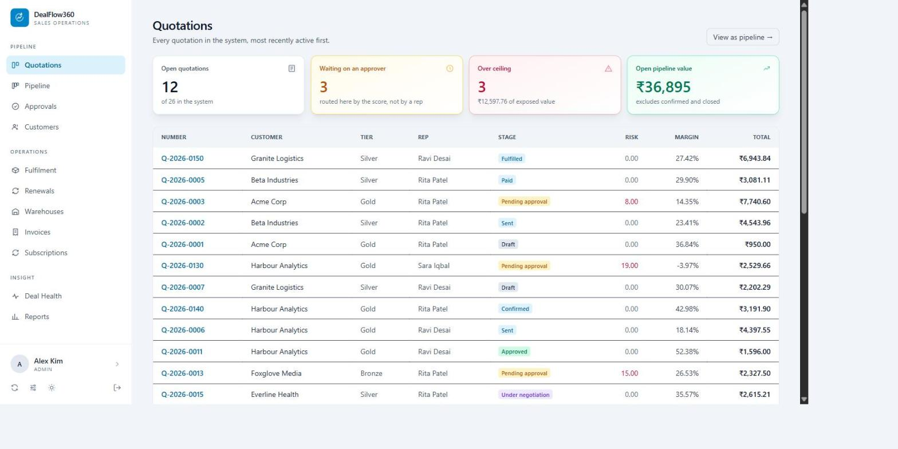
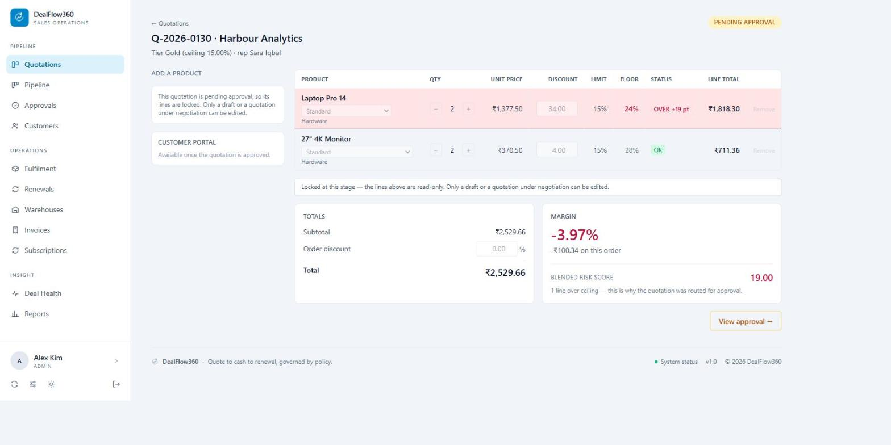
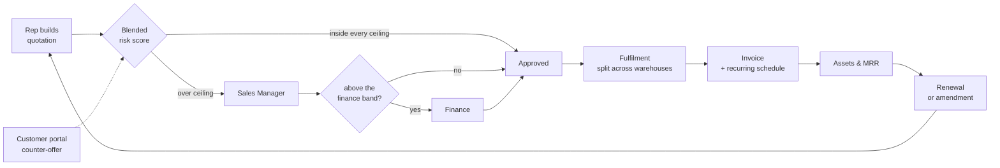

<div align="center">

# DealFlow360

**Sales operations that govern themselves.**

Quote to cash to renewal, with the pricing discipline built into the workflow
rather than bolted on after the discount has already been given.


</div>



---

## The problem

A rep gives a discount. Someone messages a manager on chat. The manager says yes.
Six weeks later nobody can tell you why that deal was approved.

Discount policy lives in a document, not in the software. DealFlow360 puts it inside the
system: **the rep never requests approval — the quotation routes itself.**

## What makes it different

**1. The score decides, not the rep.** Every line is measured against its own category
ceiling for that customer's tier. The overage is summed into a blended risk score, and
approval-chain rules — database rows, not constants — decide whether the deal is
auto-approved, needs a manager, or needs manager *and* finance.

**2. It answers the rep's actual question.** Every other tool stops at *"this needs
approval."* DealFlow360 solves backwards from its own rules and returns the number:
*"take this line to 11.4% and the quotation is auto-approved."* Same maths, run in
reverse.

**3. Two bounds on every line.** The policy ceiling above, the economic walk-away floor
below — the discount at which the line stops making money at all. The rep negotiates
inside a corridor instead of guessing.



*Limit, floor, and the exact overage on the line that caused the routing — 19 points over
on the laptop line, and the quotation sent itself for approval.*

## The flow



The dotted line is the part judges remember: a customer countering in the portal pushes
the quotation back through the same scoring rules, with no rep in the middle.

## Architecture in six lines

```
config/          settings, urls
core/            the internal application
  models/        catalogue · parties · sales · inventory · billing · assets · config
  services/      ALL business logic — risk, approval, fulfilment, billing, assets, health
  templates/     Django templates + HTMX; dark by default, light one toggle away
portal/          customer-facing app, token-scoped, no login, no request.user
```

Views are thin. Every pricing, routing, splitting and billing decision happens in
`core/services/`, so the workspace, the portal, and any future mobile client get the same
answer. Configuration — tiers, ceilings, approval bands, warehouse weights, health
thresholds — is data in the database, never a number typed into a view.

**Performance.** Every list screen runs a fixed number of queries regardless of row count,
and that is asserted in CI. See `docs/SCALE.md` for the measured budgets.

---

## Quickstart

Python 3.10+ (developed on 3.13). No database server, no Node toolchain.

```bash
git clone https://github.com/manojk909/DealFlow360.git
cd DealFlow360

python -m venv .venv
source .venv/bin/activate          # Windows: .\.venv\Scripts\Activate.ps1

python -m pip install -r requirements.txt
python manage.py migrate
python manage.py seed_demo
python manage.py runserver
```

Open http://127.0.0.1:8000/ and sign in. `seed_demo` creates the full demo dataset from
`docs/DEMO.md` — users, tiers, categories, ceilings, approval rules, customers, ten
products, subscription plans, two warehouses with deliberately split stock, and quotations
across every stage. It is idempotent.

**Demo accounts** — password `dealflow360` for all of them:

| Email | Role |
|---|---|
| `rep@dealflow.test` | Sales Rep |
| `manager@dealflow.test` | Sales Manager |
| `finance@dealflow.test` | Finance |
| `admin@dealflow.test` | Admin (superuser — the one that opens `/admin/`) |

`rep2@`, `manager2@`, `finance2@`, `admin2@` exist as a mid-demo fallback set.
Customers need no account at all — they reach a quotation through their own portal link.

Run the tests:

```bash
python manage.py test
```

Reset the database (SQLite is one file, so this takes seconds):

```bash
rm db.sqlite3 && python manage.py migrate && python manage.py seed_demo
```

---

## Status

**Feature complete against the problem statement.** Every module in PDF §4 (A1–A7, B1–B9)
is built, all eight steps of the §9 quick test flow run end to end, and **306 tests pass.**

| PDF module | Where it lives |
|---|---|
| A1 Authentication (login / signup) | `/login/`, `/signup/`, role-based access |
| A2 Products, variants, price lists | Django admin — the back-end configuration area |
| A3 Discount tiers & approval chains | Admin: ceilings per tier and per category, chain rules |
| A4 Warehouses, stock, replenishment | **Warehouses** screen per site + Admin; reorder points flag restock |
| A5 Subscription plans | Admin; daily pro-rata and credit-on-cancel rules (ADR-008) |
| A6 Upsell rules | Product pairs, promotion flags, margin floor |
| A7 Reporting & dashboard | **Reports** — period / rep / team / status / category, CSV + print |
| B1 Workspace menu | Sidebar: Quotations, Pipeline, Approvals, Fulfilment, Invoices, Subscriptions, Deal Health, Reports |
| B2 Quotation list / pipeline | **Quotations** (table) and **Pipeline** (Kanban) |
| B3 Quotation builder | Live margin, per-line ceiling check, variants |
| B4 Approval screen | Blended score, per-line breakdown, chain, audit trail |
| B5 Upsell panel | Ranked by co-purchase, margin delta, promotion tag |
| B6 Fulfilment & warehouse split | Suggested split, manual override, consolidate backorder |
| B7 Subscriptions & billing | Schedule, mid-cycle proration, cancel with credit note |
| B8 Customer portal | Separate app, token-scoped, negotiation re-enters approval |
| B9 Deal health | Stalled deals, discount anomalies, delivery slippage, nudge |
| Profile | Overview, activity, access and preferences per signed-in user |
| Customers & assets | What each account owns, MRR/ARR, and a one-click renewal queue (ADR-013) |
| Amendments | Change a live contract mid-term — co-termed, prorated, approval-routed (ADR-015) |
| **What would clear this** | Solves for the largest approvable discount and returns it to the rep (ADR-016) |
| **Two bounds** | Policy ceiling and economic floor on every line, with the approval a submit would attract, shown live (ADR-017) |

Not built, and deliberately so: multi-currency and multi-company (PDF §7 marks both a
bonus), and subscription *plan* changes as distinct from quantity changes. See
`docs/NEXT.md`.

**Themes.** Dark copies the mockup and is the default; light is one toggle in the sidebar
footer, remembered per browser.

**Currency.** ₹ (INR) by default with Indian digit grouping, set on one settings row
(ADR-014) rather than hard-coded per template.

## Stack

| Layer | Choice |
|---|---|
| Framework | Django 5.2.17 |
| Database | SQLite — one local file, `db.sqlite3` (ADR-002) |
| Templates | Django templates + HTMX; Tailwind vendored, no build step |
| Auth | `django.contrib.auth` with a custom `core.User` carrying `role` (ADR-003) |
| Tests | Django's built-in test runner — 306 tests |

Tailwind and HTMX are served from `core/static/`, not a CDN, so the demo does not depend
on venue wifi.

## Conventions that matter

- **Never change `AUTH_USER_MODEL`.** It is `core.User`, set before the first migration.
  Changing it now means deleting the database and every migration. See ADR-003.
- **Money is `Decimal`, computed in Python, inside `core/services/`.** SQLite has no
  decimal type and `Sum()` over a `DecimalField` can drift to float. See ADR-002.
- **Configuration is data, not code.** A number typed into a view is a bug.
- **Dates use `timezone.localdate()`, never `timezone.now().date()`** — the latter is UTC,
  which put the whole app a day behind between 18:30 and midnight IST.

## Deploying

Runs on a free-tier PaaS (Render) with no code changes. Build `./build.sh`, start
`gunicorn config.wsgi:application`. Five environment variables:

| Variable | Value |
|---|---|
| `DJANGO_SECRET_KEY` | any long random string |
| `DJANGO_DEBUG` | `False` |
| `DJANGO_ALLOWED_HOSTS` | `your-app.onrender.com` |
| `DJANGO_CSRF_TRUSTED_ORIGINS` | `https://your-app.onrender.com` — **full scheme required** |
| `PYTHON_VERSION` | `3.13.5` |

Two things to know rather than discover. **SQLite sits on ephemeral disk, so every redeploy
wipes it** — `build.sh` runs `seed_demo`, which is idempotent, so the instance always comes
back with the exact demo state. And **the free tier sleeps after 15 minutes idle**, so the
first request after a pause takes about 30 seconds. See ADR-018.

## Documentation

| File | What it holds |
|---|---|
| `docs/SPEC.md` | Structured product requirements (MUST / SHOULD / BONUS) |
| `docs/ARCHITECTURE.md` | Stack, layers, module boundaries |
| `docs/DATA_MODEL.md` | Entities, relationships, invariants |
| `docs/DECISIONS.md` | ADR log — 18 decisions, each with the reason and the alternative |
| `docs/SCALE.md` | Query budgets, what was fixed, what breaks first at scale |
| `docs/DEMO.md` | The five-minute demo this project must survive |
| `docs/NEXT.md` | What is deliberately unbuilt, and why |
| `tasks/BACKLOG.md` | All tasks, P0 / P1 / P2 |

---

<div align="center">

Built for the **Odoo Hackathon 2026** · solo build

</div>
